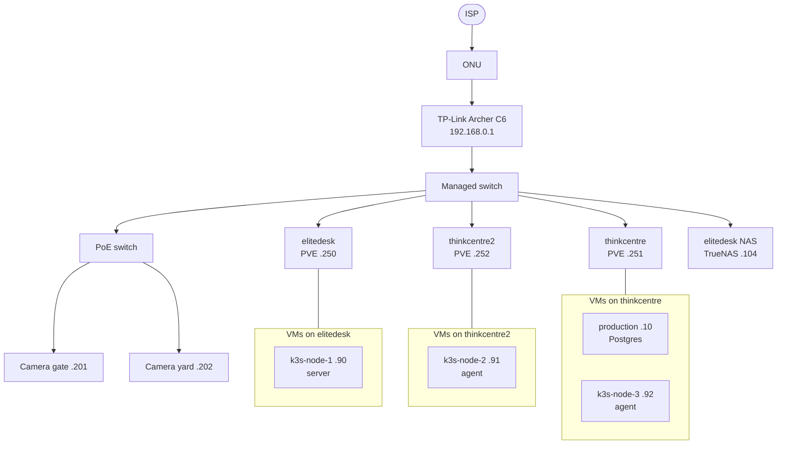
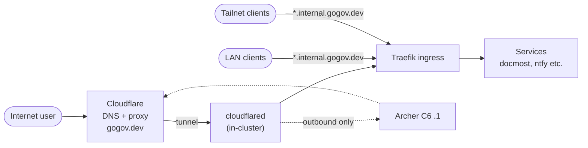
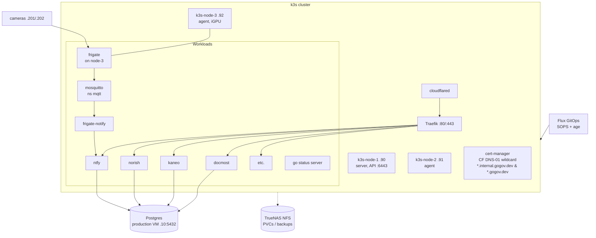

# Homelab diagrams

## 1. Physical

```mermaid
flowchart TD
  ISP([ISP]) --> ONU[ONU]
  ONU --> RTR["TP-Link Archer C6<br/>192.168.0.1<br/>"]
  RTR --> SW[Managed switch]
  SW --> POE[PoE switch]
  POE --> CAMG["Camera gate .201"]
  POE --> CAMY["Camera yard .202"]

  SW --> ED["elitedesk<br/>PVE .250"]
  SW --> TC2["thinkcentre2<br/>PVE .252"]
  SW --> TC["thinkcentre<br/>PVE .251"]
  SW --> NAS["elitedesk NAS<br/>TrueNAS .104"]

  subgraph TCV[VMs on thinkcentre]
    PROD["production .10<br/>Postgres"]
    K3["k3s-node-3 .92<br/>agent"]
  end
  subgraph TC2V[VMs on thinkcentre2]
    K2["k3s-node-2 .91<br/>agent"]
  end
  subgraph EDV[VMs on elitedesk]
    K1["k3s-node-1 .90<br/>server"]
  end
  TC --- TCV
  TC2 --- TC2V
  ED --- EDV
```

## 2. Network flow

```mermaid
flowchart LR
  U([Internet user]) --> CF["Cloudflare<br/>DNS + proxy<br/>gogov.dev"]
  CF -->|tunnel| CFD["cloudflared<br/>(in-cluster)"]
  CFD --> TR["Traefik ingress"]
  TR --> APPS["Services<br/>docmost, ntfy etc."]

  RTR["Archer C6 .1"]
  CFD -.outbound only.-> RTR
  RTR -.-> CF

  LAN([LAN clients]) -->|"*.internal.gogov.dev"| TR
  TSC([Tailnet clients]) -->|"*.internal.gogov.dev"| TR
```

## 3. k3s

```mermaid
flowchart TD
  FLUX["Flux GitOps<br/>SOPS + age"] --> CL

  subgraph CL[k3s cluster]
    N1["k3s-node-1 .90<br/>server, API :6443"]
    N2["k3s-node-2 .91<br/>agent"]
    N3["k3s-node-3 .92<br/>agent, iGPU"]
    TR["Traefik :80/:443"]
    CM[cert-manager<br/>CF DNS-01 wildcard<br/>*.internal.gogov.dev & *.gogov.dev]
    CFD[cloudflared]
    subgraph apps[Workloads]
      DOC[docmost]
      KAN[kaneo]
      NOR[norish]
      NTFY[ntfy]
      MQ["mosquitto<br/>ns mqtt"]
      FR["frigate<br/>on node-3"]
      FN[frigate-notify]
      MON["etc."]
      GO[go status server]
    end
  end

  CFD --> TR --> DOC & KAN & NOR & NTFY & MON
  FR --> MQ --> FN --> NTFY
  N3 --- FR
  PG[("Postgres<br/>production VM .10:5432")]
  NFS[("TrueNAS NFS<br/>PVCs / backups")]
  DOC & KAN & NOR & NTFY --> PG
  CL -.-> NFS
  CAMS["cameras .201/.202"] --> FR
```